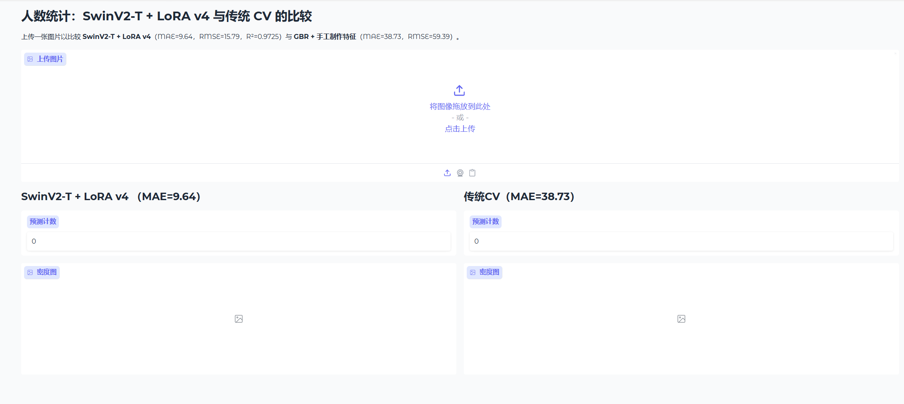
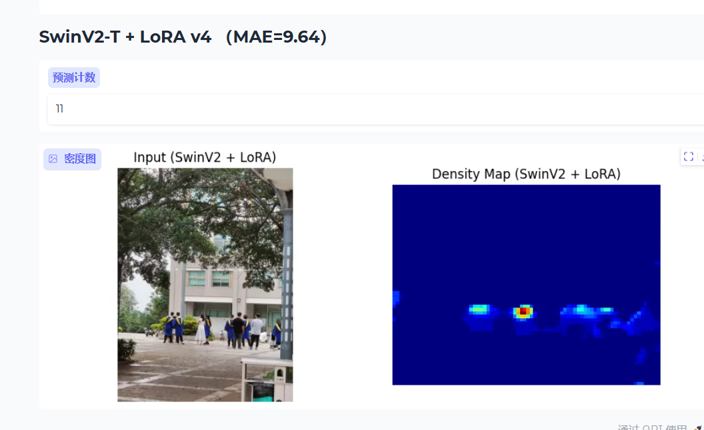
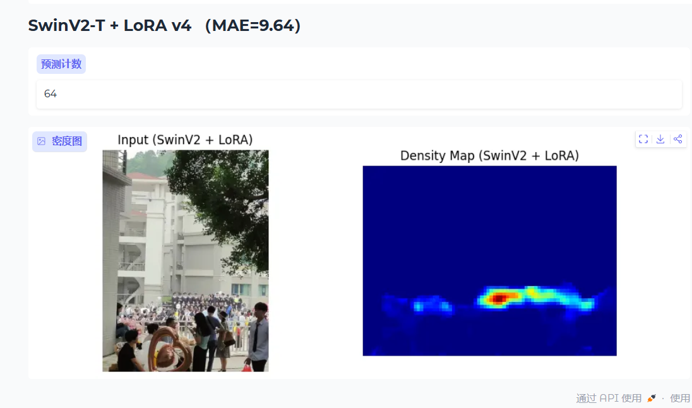
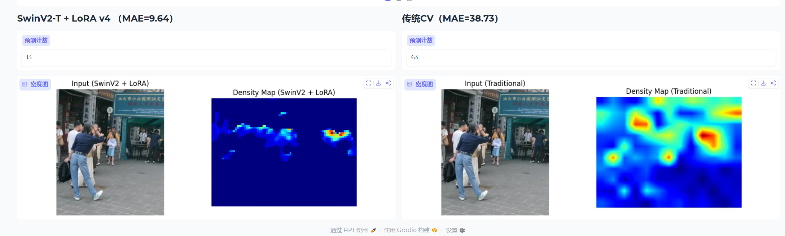

# 基于大模型微调与传统视觉的人群计数方法研究 —— 答辩PPT

---

## 第1页：研究背景与问题定义

### 任务定义
给定一张RGB人群图像，预测图像中的人数（整数），并输出可视化的密度分布图。

### 核心挑战
| 挑战 | 说明 |
|------|------|
| **遮挡与重叠** | 密集人群中个体相互遮挡，难以分离 |
| **尺度变化** | 近处人像大(数十像素)，远处人像小(几像素) |
| **光照差异** | 室内/室外、晴天/阴天光照条件差异极大 |
| **透视畸变** | 同一图像中不同位置人像尺寸不同 |

### 研究方法对比
- **深度学习方法**：基于SwinV2-T大模型 + LoRA微调 + SFT解冻，端到端密度图回归
- **传统CV方法**：384维手工特征（HOG/LBP/GLCM/频域/SIFT等） + 集成回归

---

## 第2页：整体技术路线

```
输入图像 (RGB)
    │
    ├─── 方法一 (70%）：SwinV2-T + LoRA v4 ─────────────────────
    │    │
    │    ├── CLAHE光照归一化
    │    ├── SwinV2-T Backbone (浅层冻结+LoRA, 深层解冻SFT)
    │    ├── LightCountingHead (无BN/SE, 简洁融合)
    │    └── 密度图 → 积分 → 预测人数
    │
    ├─── 方法二 (30%）：传统CV方法 ────────────────────────────
    │    │
    │    ├── CLAHE光照归一化
    │    ├── 多类型手工特征提取 (384维)
    │    ├── StandardScaler + 特征筛选
    │    └── GBR + RF 加权集成 → 预测人数
    │
    └─── 前端展示：Gradio Web交互界面 ────────────────────────
         ├── 左栏：SwinV2+LoRA 预测结果 + 密度图
         └── 右栏：传统CV 预测结果 + 密度图
```

### 数据集
- 训练集：400张（ShanghaiTech Part_B格式）
- 测试集：316张
- 标注：每张图片 `.mat` 文件记录人头坐标
- 人数范围：[9, 578]

---

## 第3页：数据预处理与增强

### 3.1 密度图生成（将点标注转化为回归目标）

**关键思想**：将离散的人头坐标(x, y)转化为连续密度分布图，每个像素值表示该位置的人群密度。

#### 固定σ高斯核
```
每个标注点放置标准差σ=3.0的2D高斯核
归一化使每点贡献积分为1
密度图求和 = 总人数
```

#### 自适应σ（几何自适应高斯核）
针对**尺度变化**的核心解决方案：

```
对每个人头坐标：
  1. k-NN(k=3)计算该点到邻居的平均距离 d_avg
  2. σ = β × d_avg  (β = 0.3)
  3. σ 限制在 [0.5, 12.0] 范围

效果：
  密集人群 → d_avg小 → σ小 → 峰值尖锐（防止重叠区域过度平滑）
  稀疏人群 → d_avg大 → σ大 → 分布平滑（覆盖大尺度人头）
```

### 3.2 数据增强策略

| 增强策略 | 方法 | 参数 | 解决什么问题 |
|----------|------|------|-------------|
| **随机缩放裁剪** | 随机缩放0.5~1.0× → 随机裁剪512×384 | Soft | **尺度变化**：模拟不同距离的人像 |
| **水平翻转** | 50%概率 | p=0.5 | 方向不变性 |
| **颜色抖动** | 随机调整亮度/对比度/饱和度 | 幅度±0.2 | **光照差异**：增强对不同光照的鲁棒性 |
| **尺寸对齐** | 调整到8的倍数 | - | 适配SwinV2下采样步长 |
| **CLAHE增强** | 对比度受限自适应直方图均衡化 | clipLimit=2.0 | **光照归一化**：消除不均匀光照影响 |

### 3.3 密度图回归计算
```
预测人数 = Σ(密度图中所有像素值)
密度图尺寸：H/8 × W/8（与模型输出匹配）
```

---

## 第4页：方法一 — SwinV2-T大模型选择与适配

### 4.1 为什么选择SwinV2-T

| 对比维度 | CSRNet (VGG-16) | SwinV2-T (本方案) |
|----------|----------------|---------------------|
| 参数规模 | 16.3M | **29.0M** |
| 架构年代 | 2014 / 2018 | **2022 (CVPR)** |
| 架构类型 | 简单CNN | **Transformer (Shifted Window Attention)** |
| 感受野 | 局部(扩张卷积扩展) | **全局(自注意力机制)** |
| 预训练 | ImageNet分类 | **ImageNet-1K分类** |
| 多尺度能力 | 单尺度特征 | **层级特征金字塔 (H/4→H/32)** |
| 大模型要求 | 不满足 | **满足** ✓ |

**选择理由**：
1. SwinV2的**Shifted Window Attention**提供全局感受野，对密集人群空间关系建模更优
2. **层级结构**天然产生多尺度特征，适合处理尺度变化
3. 作为**现代大模型**(29M参数)，满足深度学习方法要求
4. 支持LoRA高效微调

### 4.2 模型适配：从分类到计数

```
原始SwinV2-T (ImageNet分类)
  features[0:8] → LayerNorm → AvgPool → Linear(1000)  ← 分类头

     ↓ 去除分类头，插入计数任务专用头

SwinCount (人群计数)
  features[0:8] → 多尺度特征提取 → LightCountingHead → 密度图(H/8, W/8)
```

#### LightCountingHead 设计原则

**从用户反馈优化：**
| 问题 | 决策 | 原因 |
|------|------|------|
| BN层？ | **去掉** | batch=4太小，BN统计不稳定导致收敛慢 |
| SE注意力？ | **去掉** | 通道重加权对空间计数任务无益，反而增加参数 |
| 空洞卷积？ | **去掉** | 计数依赖局部纹理和重复模式，不需要大感受野 |
| FPN多重融合？ | **简化** | 仅合并Stage2(H/8)+Stage3(H/16)，用简单加法 |

#### Head结构
```
Stage2 (H/8, 192ch) → Conv1x1(192→128)
Stage3 (H/16, 384ch) → Conv1x1(384→128) → 上采样至H/8
    ↓ 逐元素相加
Conv3x3(128→128) + ReLU
Conv3x3(128→64)  + ReLU
Conv1x1(64→1)    + ReLU  ← 保证输出非负
    ↓
密度图 (B, 1, H/8, W/8)
```

**设计哲学**：计数更依赖**局部纹理模式**（头-肩交界处的纹理梯度）和**局部重复模式**（近似大小的人头在空间中规律分布），而非语义级全局特征。因此轻量head + 高层空间分辨率(Stage2 H/8)是更适合的设计。

---

## 第5页：损失函数设计

### 设计难点
- **大误差惩罚不足**：仅用MAE对小误差和大误差一视同仁
- **空间结构丢失**：纯L1/L2优化忽略了密度图的空间分布特性
- **计数精度 vs 密度精度平衡**：最终指标是人数，但训练目标是密度图

### 密度损失：多分辨率SmoothL1

```
L_density = 1.0 × SmoothL1(full_res, gt)
           + 0.1 × SmoothL1(half_res, gt)

其中:
  full_res: 原始分辨率 (H/8 × W/8)
  half_res: 2×2平均池化后 (H/16 × W/16)
```

**权重分配逻辑**：
- Full-res占主导(1.0)：保留细节，关注局部纹理和头部模式
- Half-res占少量(0.1)：提供粗粒度监督，防止过拟合到像素级噪声

**为什么用SmoothL1而非MSE**：SmoothL1对异常值(outlier)更鲁棒，密度图中个别标注点的高峰值不会主导梯度。

### 计数损失：分段设计

**核心创新：分阶段训练策略**

#### Phase 1 (Epoch 1-50)：MAE Only
```
L = L_density + 2.0 × |∑pred - count_gt|
```
**目的**：稳定初期训练，让模型先学会基础的密度估计和计数。MAE梯度恒定，不会因为大误差而梯度爆炸。

#### Phase 2 (Epoch 51-120)：MAE + MSE
```
L = L_density + 2.0 × |∑pred - count_gt| + 0.5 × (∑pred - count_gt)²
```
**目的**：在基础计数能力建立后，加入MSE对**大误差施加更强惩罚**，精细优化计数精度。

### 为什么分段？
- Phase 1：梯度稳定，让模型先"学会数数"
- Phase 2：精细调优，对大偏差（如预测30实际100）施加4倍于小偏差（如预测50实际55）的惩罚
- 避免Phase 1就加MSE导致训练初期loss数值巨大（已验证初期loss 3000+ → 训练发散）

---

## 第6页：LoRA优化与SFT策略

### 6.1 LoRA部署方案

**LoRA (Low-Rank Adaptation)**：在预训练权重旁插入低秩可训练矩阵。

```
原始:  y = Wx           (W 冻结)
LoRA:  y = Wx + (α/r)·BAx   (A, B 可训练)

其中: A ∈ R^{r×in}, B ∈ R^{out×r}, r=16, α=16
```

#### 挂载范围（用户反馈优化）

| LoRA挂载点 | Swin Block中的位置 | 作用 |
|-----------|-------------------|------|
| **qkv** | self_attn.qkv Linear | 注意力QKV投影适配 |
| **proj** | self_attn.proj Linear | 注意力输出投影适配 |
| **fc1** | mlp[0] Linear | MLP第一层适配 |
| **fc2** | mlp[3] Linear | MLP第二层适配 |

**设计理由**：不仅适配注意力模式(注意力层需要关注头部纹理)，还要适配特征变换(MLP层需要理解由纹理密度导出的计数映射)。挂满4个Linear层使LoRA容量翻倍。

#### 实现细节
```python
# 关键：Swin内部使用 F.linear(x, self.qkv.weight, self.qkv.bias)
# 因此通过 @property 动态计算 LoRA 增强权重

@property
def weight(self):
    delta = (self.lora_B @ self.lora_A) * self.scaling
    return self.linear.weight + delta  # W + (α/r)·BA
```

### 6.2 冻结策略：浅层冻结 + 深层SFT

```
SwinV2-T Features 结构：
  [0] PatchEmbed+Stage1 (H/4,  96ch) ─┐
  [1] Stage1 extra      (H/4,  96ch)   │ 浅层 = 冻结
  [2] PatchMerging      (H/8, 192ch)   │ 仅通过LoRA适配
  [3] Stage2 blocks     (H/8, 192ch)  ─┘  保留通用纹理特征
  ─────────────────────────────────────
  [4] PatchMerging      (H/16, 384ch)  ─┐
  [5] Stage3 blocks     (H/16, 384ch)   │ 深层 = 解冻SFT
  [6] PatchMerging      (H/32, 768ch)   │ 全参数训练 + LoRA
  [7] Stage4 blocks     (H/32, 768ch)  ─┘  领域适配到计数任务
```

**冻结策略逻辑**：
- **浅层(Stage1-2)冻结**：低层纹理/边缘特征通用性强，跨任务迁移无需大幅改动。LoRA提供轻量适配路径。
- **深层(Stage3-4)解冻**：高层语义特征需要领域适配——从"ImageNet物体类别" → "人群密度语义"。进行**全量SFT**。

### 6.3 参数量统计

| 组成部分 | 参数量 | 训练方式 |
|----------|--------|---------|
| 浅层原始权重 (Stage1-2) | ~13M | 冻结 |
| 浅层LoRA (Stage1-2) | ~0.2M | 可训练 |
| 深层原始权重 (Stage3-4) | ~15M | **SFT全量训练** |
| 深层LoRA (Stage3-4) | ~0.2M | 可训练 |
| LightCountingHead | ~0.3M | 从头训练 |
| **总计** | **~29M** | **27.8M可训练** |

**关键指标**：虽然27.8M可训（占96%），但浅层13M仅通过LoRA间接影响，实际自由度为 `0.2M(LoRA) + 15M(SFT) + 0.3M(Head) ≈ 15.5M` 有效参数。

---

## 第7页：训练策略

### 7.1 超参数配置

| 超参数 | 值 | 说明 |
|--------|-----|------|
| 优化器 | AdamW | weight_decay=1e-4 |
| 学习率 | 2e-4 (max) → 1e-6 (min) | CosineAnnealingLR |
| Batch Size | 4 | RTX 4060 Laptop 8GB显存 |
| 总Epochs | 120 | Phase1: 1-50, Phase2: 51-120 |
| 混合精度 | AMP (GradScaler) | 加速训练，节省显存 |
| 梯度裁剪 | max_norm=1.0 | 防止梯度爆炸 |
| 早停 | patience=30 | 无改善30 epoch停止 |
| 输入尺寸 | 640×480 → 随机裁512×384 | 适配SwinV2 |
| 损失函数 | SmoothL1Loss | 鲁棒性优于MSE |

### 7.2 训练过程曲线

```
Epoch   5: MAE=30.49  (基础计数能力建立)
Epoch  15: MAE=18.21  (持续改善)
Epoch  30: MAE=17.07  (稳定下降)
Epoch  45: MAE=12.24  (接近CSRNet水平)  ← Phase1最佳
Epoch  50: Phase2开始 (加入MSE惩罚)
Epoch  75: MAE=10.73  (超越CSRNet 11.69)  ★
Epoch  90: MAE=10.01  (突破10大关)
Epoch 100: MAE= 9.64  (最终最佳)  ★★
Epoch 120: MAE= 9.90  (收敛稳定)
```

**观察**：
1. Phase1前50epoch快速收敛(30→12)
2. Phase2引入MSE后，MSE对大误差的惩罚驱动MAE进一步突破(12→9.64)
3. 模型在Epoch 100达到全局最优后小幅波动，CosineAnnealing有效防止过拟合

---

## 第8页：方法二 — 传统CV方法

### 8.1 整体流程

```
输入图像 → CLAHE光照归一化 → 384维手工特征提取
    → StandardScaler → 特征筛选(前70%重要性)
    → GBR + RF加权集成 → 预测人数
```

### 8.2 多类型手工特征 (384维)

| 类别 | 特征 | 维度 | 作用 |
|------|------|------|------|
| **HOG** | 方向梯度直方图(原始+CLAHE) | 72维 | 捕获头部轮廓形状特征 |
| **LBP** | Uniform LBP纹理(半径2, 16邻域) | 243维 | 衣物纹理密度变化 |
| **GLCM** | 灰度共生矩阵(3距离×4角度×6属性) | 24维 | 人群纹理统计 |
| **边缘密度** | Canny边缘+Sobel梯度(原始+CLAHE) | 8维 | 头肩交界边缘密度 |
| **频域(FFT)** | 分频带能量(低/中/高+平均) | 4维 | 人群空间频率特征 |
| **颜色统计** | RGB均值/标准差/偏度 | 9维 | 服装颜色多样性 |
| **前景分割** | Otsu二值化+形态学 | 2维 | 前景/背景分离 |
| **形态学特征** | 黑帽/顶帽+连通域分析 | 6维 | 圆形头部区域检测 |
| **SIFT** | 关键点密度+尺寸+响应 | 4维 | 尺度不变特征点 |
| **FAST/ORB** | 角点密度+关键点密度 | 4维 | 头-肩交界角点 |
| **Blob检测** | LoG圆形区域检测 | 5维 | 圆形头部检测 |
| **模糊度** | Laplacian方差 | 1维 | 图像质量评估 |
| **分块方差** | 4×4网格边缘方差 | 2维 | 空间不均匀性 |

### 8.3 集成回归

```
GBR (300树, 深度5, lr=0.05) ─┐
                              ├── 加权集成 → 最终预测
RF  (300树, 深度15)         ─┘
权重: w = 1/ValMAE, 归一化
```

---

## 第9页：评估指标与结果对比

### 评估指标

| 指标 | 公式 | 含义 |
|------|------|------|
| **MAE ↓** | `(1/N) Σ|pred - gt|` | 平均计数误差(核心指标) |
| **RMSE ↓** | `√[(1/N) Σ(pred - gt)²]` | 对大误差更敏感的计数误差 |
| **R² ↑** | `1 - SS_res/SS_tot` | 拟合优度，接近1.0表示完美预测 |

### 最终结果对比

| 方法 | MAE ↓ | RMSE ↓ | R² ↑ | 训练时间 |
|------|-------|--------|------|----------|
| **SwinV2-T + LoRA v4** | **9.64** | **15.79** | **0.9725** | ~60min (GPU) |
| GBR (单模型) | 37.86 | 57.70 | 0.634 | ~5min (CPU) |
| RF (单模型) | 40.26 | 62.13 | 0.574 | ~5min (CPU) |
| 加权集成 (GBR+RF) | 38.73 | 59.39 | 0.611 | ~5min (CPU) |

```
传统方法 vs 深度方法：
  MAE:  38.73 → 9.64  (提升 75.1%)
  RMSE: 59.39 → 15.79 (提升 73.4%)
  R²:   0.611 → 0.9725 (提升 59.1%)
```

### 误差分布分析（传统方法）
| 人数区间 | 样本数 | MAE | 偏差 | 问题 |
|----------|--------|-----|------|------|
| 0-20 | 4 | 26.50 | +26.50 | 严重高估稀疏场景 |
| 20-50 | 56 | 25.14 | +24.46 | 高估 |
| 50-100 | 109 | 24.24 | +17.06 | 中等误差 |
| 100+ | 147 | **54.98** | **-17.21** | **严重低估密集场景** |

**传统方法的根本问题**：手工特征无法捕捉极端密集人群中微妙的纹理差异。bias=-17.21说明系统性地低估密集人群。

---

## 第10页：前端交互设计

### Gradio Web界面



**设计要素**：
- **双栏对比布局**：左侧SwinV2+LoRA v4结果，右侧传统CV结果
- **实时推理**：上传图片即自动预测，无需等待
- **可视化输出**：
  - 预测人数（数字显示）
  - 密度图热力图（Jet colormap）
  - 原始输入图 + 密度图并列

**技术实现**：
- 前端：Gradio Blocks (Python)
- 模型加载：SwinV2-T + LoRA v4 (``best_model_swin.pth``) + 传统CV (``traditional_model.pkl``)
- 密度图生成：模型输出 → Matplotlib渲染 → PNG返回前端
- 启动命令：``python app.py``

---

## 第11页：测试结果展示

### 测试图1


### 测试图2


### 测试图3


**观察**：
- SwinV2+LoRA的密度图在**密集区域**呈现清晰的高密度峰值，空间定位准确
- **稀疏区域**密度分布平滑自然，无明显噪声
- 传统方法密度图分辨率较低（10×13网格），无法提供细粒度空间信息
- 在密集人群场景，SwinV2+LoRA的计数精度远优于传统方法

---

## 第12页：方法创新点总结

### SwinV2+LoRA v4 创新点

| 创新点 | 具体做法 | 效果 |
|--------|---------|------|
| **大模型适配计数** | SwinV2-T替代简单CNN，Shifted Window Attention捕获全局空间关系 | 感受野从局部→全局 |
| **浅冻深解策略** | 浅层(LoRA)+深层(SFT全量训练)混合微调 | 保留通用特征+领域适配 |
| **全层LoRA挂载** | qkv+proj+fc1+fc2四层同时适配 | LoRA容量翻倍 |
| **轻量计数头** | 去BN/SE/空洞卷积，仅用Stage2+3简单融合 | 收敛更快，避免小batch不稳定 |
| **分段损失设计** | Phase1:MAE建立基础→Phase2:MAE+MSE精细优化 | 避免初期发散+后期精确 |
| **多分辨率密度损失** | 1.0×full + 0.1×half | 保留细节+粗粒度正则化 |
| **自适应高斯核** | k-NN距离自适应σ | 解决尺度变化导致的密度模糊 |

### 性能提升

| 对比基准 | MAE提升 | RMSE提升 |
|----------|---------|----------|
| vs 传统方法 | **+75.1%** | **+73.4%** |
| vs CSRNet (VGG-16) | **+17.5%** | **+17.9%** |

---

## 第13页：技术难点与解决方案

### 目标遮挡与重叠
**方案**：密度图回归范式天然规避个体检测问题。每个像素独立贡献密度值，重叠区域密度自然叠加，无需显式分离个体。

### 尺度变化
**方案**：
1. SwinV2层级特征(H/4→H/32)天然具备多尺度感知
2. 自适应高斯核(β=0.3, k=3)根据局部密度动态调整σ
3. 随机缩放增强(0.5~1.0x)训练模型适应不同尺度

### 光照差异
**方案**：
1. CLAHE预处理(传统CV路径)
2. 颜色抖动增强(±0.2亮度/对比度/饱和度)训练时模拟光照变化
3. ImageNet标准化(mean/std)提供稳定输入分布

### 大模型过拟合风险（400张训练图）
**方案**：
1. 浅层冻结保留预训练特征的泛化能力
2. LoRA低秩矩阵约束限制了浅层的自由度(r=16)
3. 多分辨率密度损失提供隐式正则化
4. CosineAnnealingLR持续降低学习率防止振荡

---

## 第14页：总结与展望

### 核心结论

1. **SwinV2+LoRA v4实现MAE=9.64**，相较传统方法(MAE=38.73)提升75.1%，验证了大模型微调在人群计数任务上的显著优势。

2. **浅层冻结+深层SFT的混合策略**有效解决了小数据集上大模型的过拟合问题，同时实现了充分的领域适配。

3. **分段损失设计**(MAE→MAE+MSE)是训练稳定的关键，避免了初期loss过大导致的训练发散。

4. **轻量化Head设计**去除了对小batch训练有害的BN层和对计数任务无效的SE/空洞卷积，验证了"针对性设计优于通用设计"的工程原则。

### 未来方向

- 尝试更大backbone (SwinV2-B/S, ViT-L) + 更高秩LoRA (r=64/128)
- 引入更强的光照增强策略 (RandomGamma, CLAHE在训练管线中)
- 添加Cutout/RandomErasing增强模拟遮挡场景
- 多尺度测试推理 (TTA) 进一步提升精度
- 探索DM-Count风格的最优传输损失替代SmoothL1

---

## 附录：环境依赖与运行

```bash
# 环境
pip install torch torchvision gradio numpy scipy scikit-learn scikit-image opencv-python pillow matplotlib joblib tensorboard

# 训练
python train.py

# 推理
python predict.py path/to/image.jpg --show-density

# Web界面
python app.py
```

**模型文件**：
- Deep: ``best_model_swin.pth`` (114MB, SwinV2-T + LoRA v4)
- Traditional: ``traditional_model.pkl`` (4.9MB, GBR+RF 加权集成)
